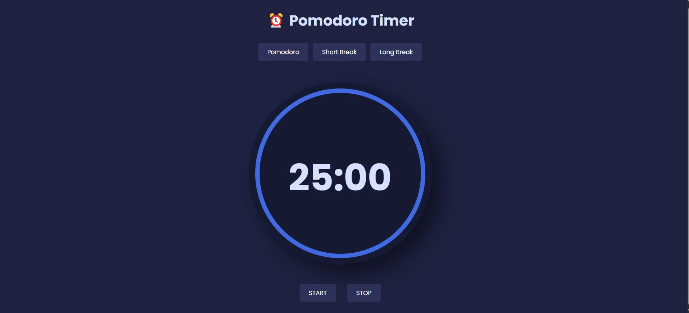

# ⏳ Pomodoro Timer

Boost your productivity with this sleek and simple **Pomodoro Timer** built using **HTML, CSS, and JavaScript**. This timer follows the famous **Pomodoro Technique** to help you stay focused and organized during your work sessions.

  
<small>_Screenshot of the Timer in action_</small>

## 🚀 Features

- **25-minute focus sessions** followed by **5-minute breaks**
- Sleek and responsive **UI** for all screen sizes
- Real-time **timer display**
- Interactive **start/pause/reset** functionality
- Fully customizable with clean, easy-to-read code

## 🎯 How It Works

The Pomodoro technique is designed to enhance your focus and efficiency:
1. Work for **25 minutes**.
2. Take a **5-minute break**.
3. Repeat this cycle for increased productivity!

## 🛠️ Technologies Used

- **HTML5** for the structure.
- **CSS3** for the style.
- **JavaScript** to control the timer functionality.

## 📂 Installation

1. Clone this repository:
    ```bash
    git clone https://github.com/itspritam008/pomodoro-timer.git
    ```
2. Open `index.html` in your favorite browser.

## ✨ Usage

1. Hit the **Start** button to begin your Pomodoro session.
2. **Pause** or **Reset** the timer as needed.
3. Stay productive and keep track of your breaks with ease!

## 🌟 Demo

Check out the live demo of this Pomodoro Timer [here](#).

## 🖌️ Customization

Feel free to modify the code to match your style. Change the colors, fonts, or even the duration of your work and break sessions!


Give this project a ⭐ if you find it useful!  

Happy coding! 😄
